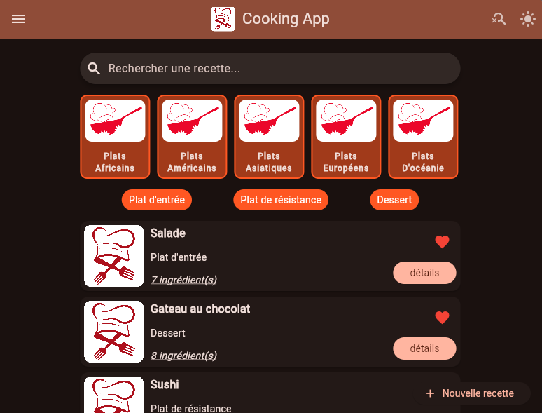
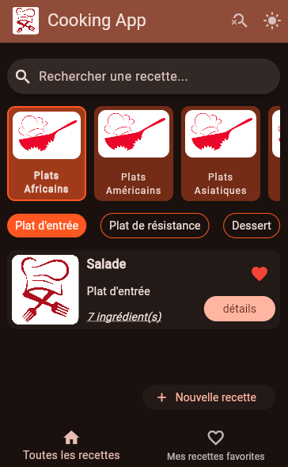
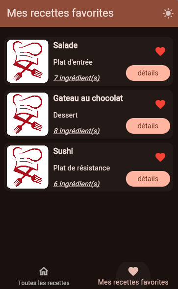
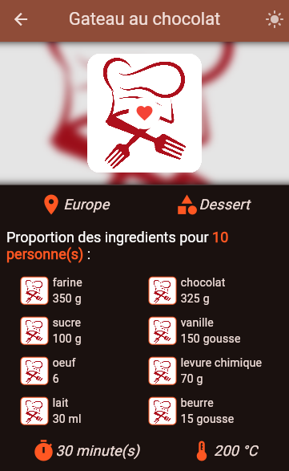
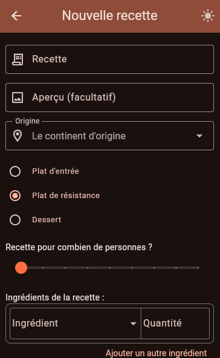

  

# CookingApp
Application Flutter de recettes de cuisine

# Lancement de l'application
- Se positionner à la racine du projet
- Taper la commande : `flutter run -d <id_appareil>`

# Fonctionnalités implémentées
- Listing des recettes de cuisine
- Possibilité de filtrer les recettes selon leur origine ou encore leur catégorie
- Afficher plus en détails une recette pour voir tous les ingrédients
- Mettre tes recettes préférées en favoris
- Ajouter tes propres recettes de façon personnalisée
- Gestion du thème de l'application en mode clair ou sombre
- L'app est entièrement responsive et se présente bien sur tous types d'écran

# Aperçu de l'application
## Vue Desktop

## Vues Mobile

